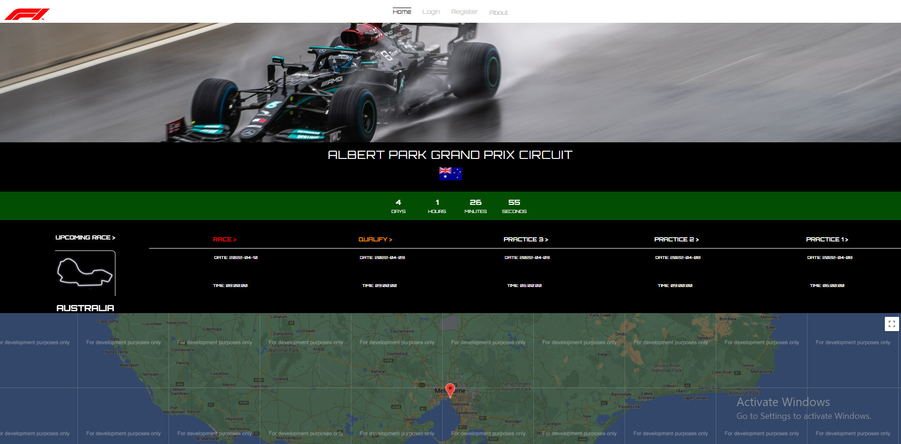
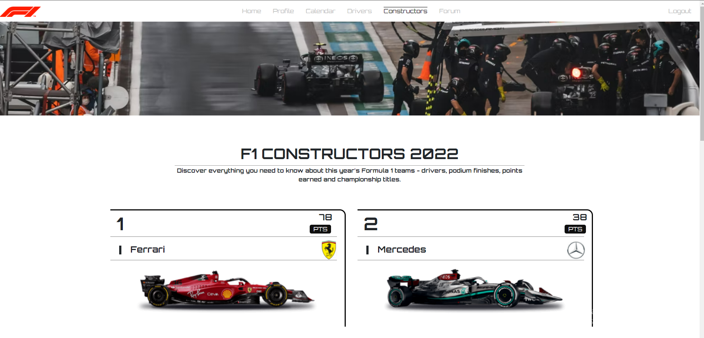
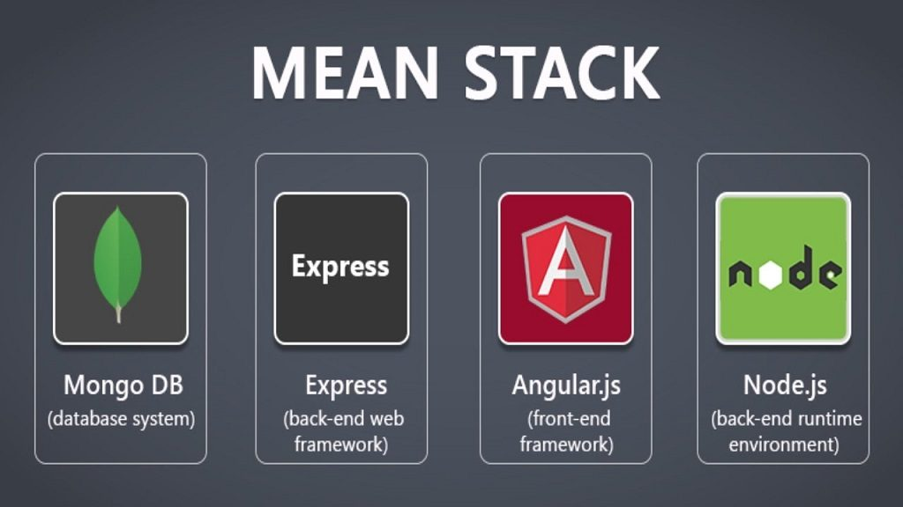

# Formula 1 EXAM-APP

**A Formula 1 website project for educational purposes. The app itself is created to be used by fans of the sport to be informed for every race, pilot and constructor which take place in current season of Formula 1 championship. The goal of the app is to connect enthusiasts of this sport and to share emotions together.**

  
 
<h3 style="text-align: center">

 <h4> USED STACK </h4>
</h3>

 

### Features of the platform are not finished. Updates to come soon.

- Responsive design
- Home page
- Shows the upcoming race
- Countdown the time to the start of the race
- Information about the race - date and time of practices/qualis/race
- Google maps to target the host city of the race

  

### **Profile page**
- #### **My account section**
 Show personal information of the current user

  

- #### **My publications section**
 Show current user publications
 
  

- #### **Create publication section**
 Form to create a post on topic that you're interested in

 

### **Calendar page**

- Updates dynamically the race calendar for the year
- Shows information about each race of the calendar
- By clicking on a race, you'll be navigated to race's details page

 

### **Drivers page**
- Updates dynamically the drivers of the season if there are changes
- Shows information about each driver of the season
- By clicking on a driver, you'll be navigated to driver's details page

 

### **Constructors page**
- Updates dynamically the points and position of each constructor from the current racing season

 

### **Forum page**
- All users publications are displayed in the forum page
- User can review, post a comment and share information with other users about a topic
- Edit/Delete of the publication options if the user is author of the publication
- Each user will be able to post a comment on topic he wants

 

### **Register page**
- Everyone will be able to make an account to join the F1 community

 

### **Login page**
- Everyone will be able to login into their accounts and use its functionality

## Used:
 - https://ergast.com/mrd/ free API to fetch up-to-date Formula 1 data
 - https://www.formula1.com/en.html for drivers, races and constructors images, information and more
 - https://developers.google.com/maps to fetch data from the google maps API
 - https://unsplash.com/ to get images for some of the pages
 - https://getbootstrap.com/ for some components

## Additional libraries used in the project
 - https://www.npmjs.com/package/bcryptjs for hashing the users passwords
 - https://www.npmjs.com/package/jsonwebtoken for the user's authentication
 - https://axios-http.com/docs/intro to make HTTP requests for fetching data from the ergas.com API
 - https://www.mongodb.com/ for the database
 - https://mongoosejs.com/ for object modeling and interacting with the database - MongoDB
